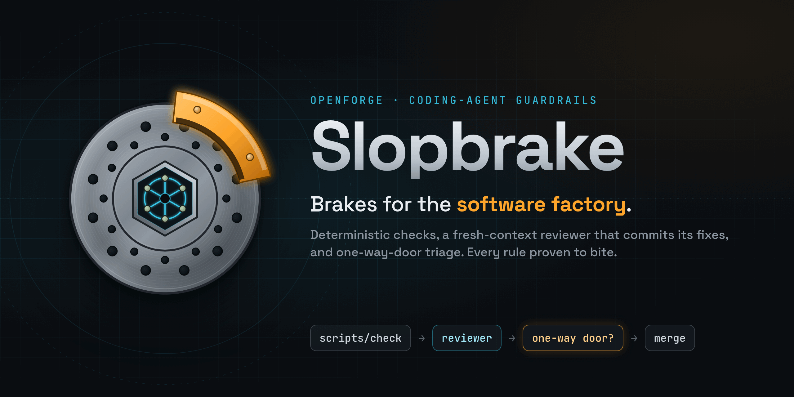
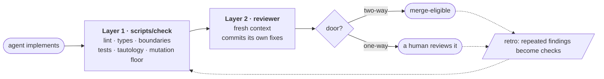
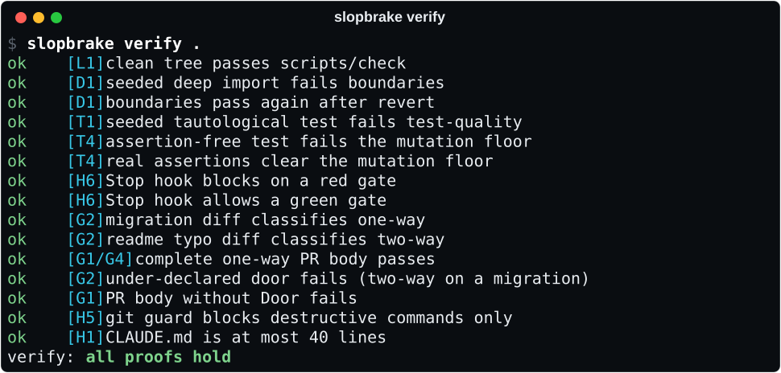
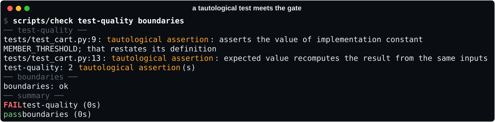

<p align="center">
  
</p>

<p align="center">
  <a href="https://github.com/GreyforgeLabs/slopbrake/actions/workflows/ci.yml"></a>
  <a href="LICENSE"></a>
  
  
  
  
</p>

<p align="center">
  <a href="#quick-start">Quick start</a> ·
  <a href="#what-it-catches">What it catches</a> ·
  <a href="#how-it-works">How it works</a> ·
  <a href="docs/RULES.md">The rules</a> ·
  <a href="CHANGELOG.md">Changelog</a> ·
  <a href="#credits">Credits</a>
</p>

---

> Without brakes, a software factory becomes a slop cannon.
> — paraphrasing [Matt Pocock, *Fixing the PR Bottleneck*](https://www.youtube.com/watch?v=LlgiOCmFG_w)

Coding agents write code faster than anyone can review it. They also write **tests that pass forever and catch nothing**, reach into modules they shouldn't, and hand you a pile of PRs that all look equally safe to merge.

**Slopbrake** installs the brakes. Every change an agent makes goes through the same three layers. Every review comment that keeps coming back becomes a check that runs before the next change.



## Quick start

```sh
uv tool install git+https://github.com/GreyforgeLabs/slopbrake    # or: pipx install git+https://…

cd path/to/repo
slopbrake init . --dry-run          # see exactly what it would add
slopbrake init .                    # add it; never overwrites files you own
git switch -c add-slopbrake         # the kit is a one-way door: the gate refuses it on the default branch
git add -A && git commit -m 'Add slopbrake guardrails'   # init prints the exact paths to add
slopbrake verify .                  # prove the checks bite, against the committed HEAD
slopbrake user-hooks install        # make the hooks fire wherever a session starts
slopbrake status .                  # anything still unwired is listed as a gap
```

Merge `add-slopbrake` the way you'll merge every one-way door from now on: a human reads it first.

**Why user-level hooks?** Claude Code loads a project's `.claude/settings.json` hooks only from the directory the session *started* in. Start a session in `~` or a parent folder, and the repo's git guard and Stop gate never fire. `user-hooks install` adds three entries to `~/.claude/settings.json` that act only inside repos Slopbrake manages and do nothing anywhere else. The Stop gate runs a repo's own scripts, so it only does that for repos you trust: `init` trusts the repo it installs into, and `slopbrake user-hooks trust <repo>` adds others. It refuses to install until the `slopbrake` on your `PATH` can run them.

**Codex and OpenCode.** `slopbrake user-hooks install --harness codex` adds the same three hooks to `~/.codex/hooks.json` (it needs `[features] hooks = true` in `~/.codex/config.toml`; then trust them in Codex's `/hooks` screen). `--harness opencode` installs `~/.config/opencode/plugins/slopbrake.js`, which guards shell commands, records edits, and turns a red Stop gate into a new prompt. `uninstall` and `status` take `--harness` too.

Python and TypeScript repos are supported, installed at the repository root (monorepo subdirectories are not supported yet). `init`, `status`, `verify` and `user-hooks` take `--json`. Exit codes: 0 ok, 1 a gap or a failed proof, 2 usage error. A fresh Python repo shows one gap until you choose a type checker for the `types` stage in `scripts/check`; it skips until then.

### The checks are proven, not configured

`verify` works in a throwaway git worktree of the committed HEAD. It runs 16 proofs over the 10 rules a machine can check (L1, D1, T1, T4, G1, G2, G4, H1, H5, H6). Where a rule can be broken on purpose, it plants a real violation and requires the check to **fail and name the rule**, then requires it to pass again once the violation is removed. A check that crashes can't pass a proof, a gate that leaves out one of the kit's stages fails the L1 proof, and unwired hooks fail the H5/H6 proof. The other rules guide the reviewer and the workflow; [docs/RULES.md](docs/RULES.md) marks each one Check, Review or Process.

<p align="center"></p>

### What it is not

Slopbrake brakes hurried or careless agents and makes slop visible. It is not a sandbox against an agent that sets out to evade it: editing `scripts/check`, deleting kit files, environment overrides, `git stash` and shell variables can all get around a check. That's why the files that govern the gate are one-way doors, so a human sees such edits. GitHub branch protection, not Slopbrake, is what makes CI authoritative. The known limits are listed in [docs/RULES.md](docs/RULES.md#known-limits).

## What it catches

A test like this passes forever and can never disagree with the code:

```python
from shop import discount
from shop.pricing import MEMBER_THRESHOLD

def test_threshold():
    assert MEMBER_THRESHOLD == 100               # restates the definition

def test_discount():
    total = 150
    assert discount(total, True) == total - 10   # recomputes the answer the way the code does
```

The gate says so:

<p align="center"></p>

The fix is an independent expectation, a literal or a worked example: `assert discount(150, True) == 140`. Property checks (`out == sorted(out)`) and symbolic expectations (`validate(x) == ERR_TOO_LONG`) pass untouched. To suppress one assertion, write the reason: `# slopbrake: allow-tautology: 280 is the published API limit`.

| Rule | Catches | Python | TypeScript |
|:----:|---------|--------|------------|
| **T1** | Tautological tests (constants asserted against themselves, expected values rebuilt from the test's own inputs, `expect(true).toBe(true)`) and tests with no assertion at all | AST check | `no-tautological-test` and `expect-in-test` ESLint rules |
| **T4** | Tests that can't fail: mutation score below the floor, **on changed lines only**. Nothing to mutate is a skip, never a 100% | stdlib mutator in a copy of the tree: comparisons and boundaries, arithmetic, `and`/`or`, `not`, constants and strings, deleted calls, `return None`, negated conditions | StrykerJS with `--mutate` line ranges |
| **D1** | Imports that reach past a package's entry points, at every package level, and import cycles | stdlib port of Pocock's rules | dependency-cruiser, Pocock's config |
| **G1 · G2** | PR bodies without a Door and Blast Radius; a door declared lower than the rules compute. The base revision's rules count too, so a PR can't loosen its own floor, and a one-way change can't be committed on the default branch | door classifier + PR-body check | same |
| **H5** | Force pushes in every spelling (`-f`, `+ref`, `--force-with-lease`, `--mirror`, deletes), `--no-verify` and `core.hooksPath` overrides, `reset --hard`, `clean -f`, `branch -D`, whole-tree `checkout`/`restore`, `stash drop`, reflog and ref deletion. Parsed like a shell, so `bash -c`, `eval` and `env` wrappers don't hide them | Claude Code hook | same |
| **H6** | An agent stopping with red uncommitted code, or with commits no full green run has covered (the full gate then runs and records a new last-green). After 3 red tries it may stop and report | Claude Code Stop hook | same |

All 30+ rules, with their mechanisms and proofs, are in **[docs/RULES.md](docs/RULES.md)**.

## How it works

### Layer 1: one gate, everywhere

`scripts/check` is the one command. The pre-commit hook runs it with `--fast` (no mutation), and pre-push and CI run it in full. A stage with nothing to check says `skip` with the reason, never `pass`. Mutation testing touches **only the lines you changed**, which keeps it fast enough to run on every push: since the push's remote commit, the PR's base, or, when you work straight on the default branch, since the last full green run (`refs/slopbrake/last-green/<branch>`, which every clean, all-green full run moves forward). The floor lives in the repo's own files (`scripts/check`, or `stryker.config.json` for TypeScript), so an environment variable can't lower it. The Stop hook runs the fast gate before an agent may finish with uncommitted code, and the full gate when it has commits no green run has covered. The checks are standard-library Python: they add no dependencies.

### Layer 2: a reviewer with fresh eyes that commits its fixes

The implementer has the most context pressure, so it doesn't carry the coding standards. The **reviewer** does (Pocock's push/pull split).
- Two reviewers run in parallel on separate axes and never see the implementer's conversation.
  - **Standards:** your `CODING_STANDARDS.md`, plus a Fowler smell baseline.
  - **Spec:** does the change do what the ticket asked, no less and no more?
- A single fix-mode reviewer then **commits the fixes** as `review:` commits instead of leaving comments.
- Anything that changes behaviour or touches a one-way door goes under *Open questions* for a human.

### Door triage: spend human attention where it can't be undone

Every PR declares a **Door** and a **Blast Radius**. Slopbrake *computes a floor* from path and content rules. Migrations, `DROP TABLE`, auth, billing, deploy config, outbound email, runtime file deletion, and the gate itself are all one-way. The agent may raise the door but never lower it. Two-way doors with a green gate are merge-eligible; one-way doors wait for you. The rules are read from the base revision as well as the PR, so a PR can't delete or loosen the rules that judge it. Without a PR, the gate refuses a one-way change on the default branch: commit it on a feature branch for review.

```text
$ python3 scripts/slopbrake/door_classify.py --base main
door: one-way (base main)
  - touches migrations/0007_drop_legacy.sql (path rule '**/migrations/**')
  - touches migrations/0007_drop_legacy.sql (path rule '**/*.sql')
  - migrations/0007_drop_legacy.sql:1 adds 'DROP TABLE legacy_accounts;' (content rule '(?i)\\bdrop\\s+(table|column|schema|database)\\b')
```

### Retro: comments become checks

`/retro` sorts every miss:
- *mechanical* becomes a check, with a fixture showing it fail;
- a *judgement call* becomes a line in `CODING_STANDARDS.md`;
- *navigation* trouble becomes a pointer;
- a *no-op* instruction gets deleted.

A finding that shows up twice and is still only prose counts as a failed retro.

## What a repo gets

<details>
<summary><b>Files <code>slopbrake init</code> writes</b> (kit-owned files are refreshed by <code>--update</code>; repo-owned files are written once and are yours)</summary>

| Path | Owner | Purpose |
|------|-------|---------|
| `scripts/check` | repo | The one gate command. Stage commands are yours to edit. |
| `scripts/slopbrake/` | kit | The standard-library checks. |
| `.githooks/` | kit | Layer 1 locally: the fast gate on commit, the full gate per pushed ref on push. |
| `.github/workflows/check.yml` | repo | Layer 1 in CI, set up for your package manager. Only written when the repo has a GitHub remote. |
| `.claude/agents/reviewer.md` | kit | Two-axis reviewer; review-only and fix modes. |
| `.claude/skills/implement-ticket/` | kit | Ticket → seams → TDD → gate → parallel review → door → PR body. |
| `.claude/skills/{tdd,pr,retro,…}` | kit | Pocock's skills, vendored unmodified, with our additions appended. |
| `.claude/hooks/` | kit | The git guard (`git_guard.py`) and the Stop gate (`require-green.sh`). |
| `.claude/settings.json` | merged | Wires those hooks, merged into your existing settings. |
| `.claude/slopbrake.json` | kit | The stack and kit version; `status` flags a stale kit, and the user-level hooks act only in repos that have it. |
| `.claude/door-rules.yml` | repo | What counts as a one-way door in this repo. |
| `CLAUDE.md`, `CODING_STANDARDS.md`, `docs/agents/` | repo | A 40-line navigation file; the reviewer's standards; the tracker and retro log. |
| TypeScript: `.dependency-cruiser.cjs`, `stryker.config.json`, `eslint-rules/slopbrake.mjs` | repo / kit | D1, T4, T1. |

</details>

## Where Slopbrake departs from the talks

- **Mutation testing** is ours: it's the objective test of "can this test fail?" It starts at a 60% floor on changed lines, and `/retro` raises it.
- **The tautology rule is a check, not only a standard.** Pocock's own retro skill says a mechanical rule "gets a deterministic check, full stop".
- **The door is computed, then confirmed.** Pocock has the agent declare it; we add a floor it can't lower.
- **One committer.** The two review axes run in parallel as report-only; a single fix-mode reviewer commits, so two agents never race on one branch.
- **`/implement-ticket`, not `/implement`**, because [Claude Code gives personal skills precedence over project skills](https://code.claude.com/docs/en/skills) and a personal `implement` would shadow it.

## Credits

Slopbrake stands on the work of **Matt Pocock** ([@mattpocock](https://github.com/mattpocock), [AI Hero](https://www.aihero.dev)). It turns his ideas into rules that fail a build. Where each idea comes from:

- **[`mattpocock/skills`](https://github.com/mattpocock/skills)**, vendored at `c55ee46` under its MIT license ([slopbrake/vendor/pocock-skills](slopbrake/vendor/pocock-skills)):
  - [`tdd`](https://github.com/mattpocock/skills/tree/main/skills/engineering/tdd): tautological and implementation-coupled tests, red before green, seams, vertical slices.
  - [`code-review`](https://github.com/mattpocock/skills/tree/main/skills/engineering/code-review): two axes kept apart, the Fowler smell baseline.
  - [`retro`](https://github.com/mattpocock/skills/tree/main/skills/in-progress/retro): mechanical findings become checks; implementation vs review context pressure.
  - [`pr`](https://github.com/mattpocock/skills/tree/main/skills/in-progress/pr): Summary, Evidence, Merge Danger, Door, Blast Radius.
  - [`setup-ts-deep-modules`](https://github.com/mattpocock/skills/tree/main/skills/in-progress/setup-ts-deep-modules): the dependency-cruiser rules and "prove the rules bite", the seed of `verify`.
  - [`codebase-design`](https://github.com/mattpocock/skills/tree/main/skills/engineering/codebase-design) and [`improve-codebase-architecture`](https://github.com/mattpocock/skills/tree/main/skills/engineering/improve-codebase-architecture): deep modules, the deletion test, "one adapter is a hypothetical seam".
  - [`git-guardrails-claude-code`](https://github.com/mattpocock/skills/tree/main/skills/misc/git-guardrails-claude-code): the destructive-git hook.
  - [`implement-spec`](https://github.com/mattpocock/skills/tree/main/skills/in-progress/implement-spec): one implementer fixes the review findings.
  - Vendored as-is: [`diagnosing-bugs`](https://github.com/mattpocock/skills/tree/main/skills/engineering/diagnosing-bugs), [`to-spec`](https://github.com/mattpocock/skills/tree/main/skills/engineering/to-spec), [`to-tickets`](https://github.com/mattpocock/skills/tree/main/skills/engineering/to-tickets), [`handoff`](https://github.com/mattpocock/skills/tree/main/skills/productivity/handoff), [`writing-for-agents`](https://github.com/mattpocock/skills/tree/main/skills/productivity/writing-for-agents), [`domain-modeling`](https://github.com/mattpocock/skills/tree/main/skills/engineering/domain-modeling), [`setup-matt-pocock-skills`](https://github.com/mattpocock/skills/tree/main/skills/engineering/setup-matt-pocock-skills).
- **[`mattpocock/dictionary-of-ai-coding`](https://github.com/mattpocock/dictionary-of-ai-coding)**: the vocabulary we use throughout.
- **Talks and writing**:
  - [*Fixing the PR Bottleneck*](https://www.youtube.com/watch?v=LlgiOCmFG_w): three layers, one-way and two-way doors, a reviewer that commits, retro.
  - [*Full Walkthrough: Workflow for AI Coding*](https://youtu.be/-QFHIoCo-Ko): standards pushed to the reviewer, the smart zone, grill → spec → tickets.
  - ["Tautological tests considered harmful"](https://x.com/mattpocockuk/status/2093068185830347088).
  - [*AI Skills with Matt Pocock*](https://newsletter.pragmaticengineer.com/p/ai-skills-with-matt-pocock) and [*Matt Pocock's Agentic Engineering Workflow*](https://www.youtube.com/watch?v=nQwJVHCtDDY): keep the harness small, and review the auto-merge decider rather than every PR.
- Related: **[`mattpocock/sandcastle`](https://github.com/mattpocock/sandcastle)** for running sandboxed agents.

Also: the `pr` skill's "shape of the change" section is [Dex Horthy](https://github.com/dexhorthy)'s `show-me` from [`humanlayer/skills`](https://github.com/humanlayer/skills). The TypeScript checks run on [dependency-cruiser](https://github.com/sverweij/dependency-cruiser) and [StrykerJS](https://github.com/stryker-mutator/stryker-js).

Any mistakes in turning these ideas into checks are ours, not his.

## Developing

`scripts/check` runs Slopbrake's own gate: pinned ruff, behaviour tests for every Python check (run through their command lines against seeded git repos), Slopbrake's own T1 check over those tests, RuleTester cases for the ESLint rules, and its own T4 floor on the kit's changed lines. The pre-commit hook runs it without mutation, pre-push runs the rest, and CI runs all of it on pull requests (the mutation stage reruns the suite per mutant and takes about an hour; `SLOPBRAKE_OWN_MUTATION=true` runs it locally). The brand art is generated from source: `brand/make_logo.py`, `brand/src/banner.html` and `brand/make_terminal.py`.

## License

MIT © 2026 [Greyforge Labs](https://github.com/GreyforgeLabs). The vendored skills keep their own MIT license © 2026 Matt Pocock.
